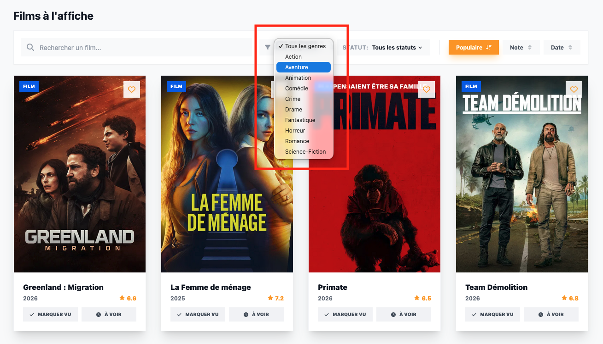
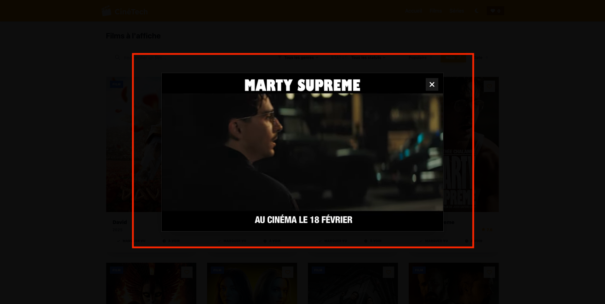
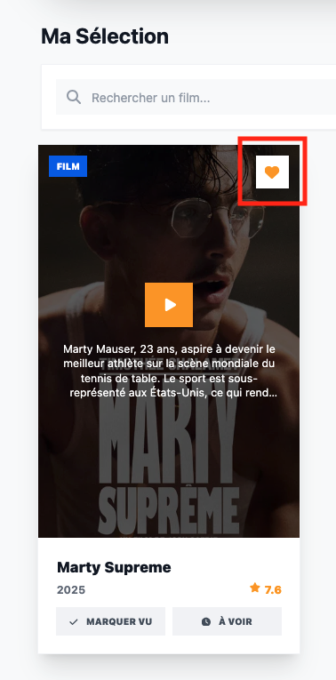
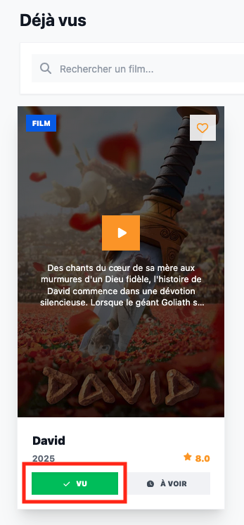
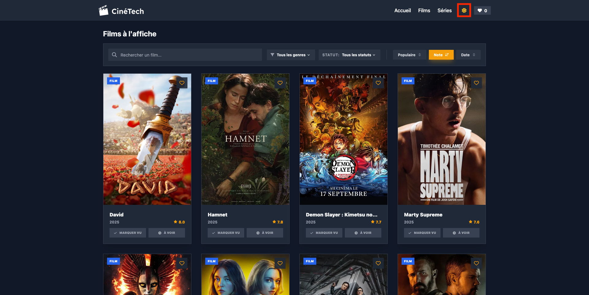

# Rapport de Mise en Œuvre des Fonctionnalités - Projet Cinetech

## 1. Introduction

Ce document présente une analyse technique détaillée de l'implémentation du projet Cinetech, structurée selon les trois lots de fonctionnalités principaux.

---

## 2. Lot n° 1 : Recherche & Tri

Ce lot concerne la découverte et l'organisation du catalogue de films et séries.

### 2.1. Recherche par titre de film
Une barre de recherche dynamique permet de filtrer les résultats en temps réel.


```javascript
// Logique de filtrage textuel dans MovieList.jsx
if (searchQuery) {
  result = result.filter(m => 
    (m.title || m.name || '').toLowerCase().includes(searchQuery.toLowerCase())
  );
}
```

### 2.2. Filtres par catégorie ou genre
L'utilisateur peut restreindre l'affichage selon les genres officiels de TMDB.


```javascript
// Filtrage par genre (ID TMDB vs Propriété locale)
if (selectedGenre !== 'all') {
  result = result.filter(m => 
    m.genre_ids?.includes(Number(selectedGenre)) || 
    (m.genre && m.genre === selectedGenre)
  );
}
```

### 2.3. Tri avancé (note, date, popularité)
Un système de tri bidirectionnel permet d'organiser les résultats selon plusieurs critères.


```javascript
// Switch de tri dans le useMemo de MovieList.jsx
switch(sortConfig.key) {
  case 'title':
    valA = (a.title || a.name || '').toLowerCase();
    valB = (b.title || b.name || '').toLowerCase();
    return sortConfig.direction === 'asc' ? valA.localeCompare(valB) : valB.localeCompare(valA);
  case 'date':
    valA = new Date(a.release_date || a.first_air_date || 0).getTime();
    valB = new Date(b.release_date || b.first_air_date || 0).getTime();
    break;
  case 'rating':
    valA = a.vote_average || 0;
    valB = b.vote_average || 0;
    break;
  case 'popularity':
    valA = a.popularity || 0;
    valB = b.popularity || 0;
    break;
}
return sortConfig.direction === 'asc' ? valA - valB : valB - valA;
```

---

## 3. Lot n° 2 : Actions

Ce lot regroupe les interactions directes avec les éléments du catalogue.

### 3.1. Bande-annonce
Chaque carte permet de visionner le trailer YouTube officiel via une modale immersive.


```javascript
// Récupération de la vidéo dans MovieCard.jsx
const fetchTrailer = async () => {
  const res = await fetch(`https://api.themoviedb.org/3/${isMovie ? 'movie' : 'tv'}/${movie.id}/videos?api_key=${API_KEY}&language=fr-FR`);
  const data = await res.json();
  const trailer = data.results.find(v => v.type === 'Trailer' && v.site === 'YouTube') || data.results[0];
  if (trailer) {
    setTrailerKey(trailer.key);
    setShowTrailer(true);
  }
};
```

### 3.2. Marquer un film comme vu
L'utilisateur peut suivre les films qu'il a déjà visionnés.


```javascript
// Gestion de l'état "Vu" dans App.jsx
const toggleWatched = (movie) => {
  setWatched(prev => {
    const exists = prev.some(m => m.id === movie.id);
    return exists ? prev.filter(m => m.id !== movie.id) : [...prev, movie];
  });
};
```

### 3.3. Marquer comme “à regarder plus tard”
Une liste de souhaits permet de sauvegarder du contenu pour plus tard.


```javascript
// Gestion de l'état "À voir" dans App.jsx
const toggleWatchLater = (movie) => {
  setWatchLater(prev => {
    const exists = prev.some(m => m.id === movie.id);
    return exists ? prev.filter(m => m.id !== movie.id) : [...prev, movie];
  });
};
```

### 3.4. Filtrer par statut
Le catalogue peut être restreint aux favoris, films vus ou à voir.


```javascript
// Filtrage par statut dans MovieList.jsx
if (selectedStatus !== 'all') {
  switch(selectedStatus) {
    case 'favorites': result = result.filter(m => favorites.includes(m.id)); break;
    case 'watched': result = result.filter(m => watched.includes(m.id)); break;
    case 'watchLater': result = result.filter(m => watchLater.includes(m.id)); break;
  }
}
```

---

## 4. Lot n° 3 : Expérience utilisateur

L'optimisation du confort de navigation et de la personnalisation visuelle.

### 4.1. Pagination des films (10 films par page)
Pour garantir la fluidité, les résultats sont découpés en pages de 10 éléments.


```javascript
// Logique de slicing dans MovieList.jsx
const startIndex = ((currentPage - 1) * itemsPerPage) % 20;
return result.slice(startIndex, startIndex + itemsPerPage);
```

### 4.2. Boutons précédent / suivant
La navigation entre les pages gère dynamiquement les appels à l'API TMDB.

```javascript
// Calcul de la page TMDB vs Page Locale
const tmdbPage = Math.ceil((currentPage * itemsPerPage) / 20);
```

### 4.3. Mode sombre / mode clair
L'application supporte le multithème avec persistance via le `LocalStorage`.



```javascript
// Persistance du thème dans App.jsx
useEffect(() => {
  localStorage.setItem('cinetech_theme', isDarkMode ? 'dark' : 'light');
  if (isDarkMode) document.documentElement.classList.add('dark');
  else document.documentElement.classList.remove('dark');
}, [isDarkMode]);
```

---

## 5. Configuration Technique

### Variables d'Environnement
Sécurisation de la clé d'API via Vite : `import.meta.env.VITE_TMDB_API_KEY`.

### Persistance
Utilisation systématique de `JSON.stringify` et `JSON.parse` pour le stockage des listes dans le `LocalStorage`.


---

## 6. Configuration et Sécurité

### 6.1. Variables d'Environnement
L'application utilise Vite pour sécuriser la clé d'API. La clé n'est jamais écrite en dur dans le code source mais injectée via `import.meta.env.VITE_TMDB_API_KEY`.

### 6.2. Persistence Locales
Toutes les préférences (Thème, Favoris, Déjà vus, À voir plus tard) sont sérialisées en JSON avant d'être envoyées au `LocalStorage` via des `useEffect` dédiés dans `App.jsx`.